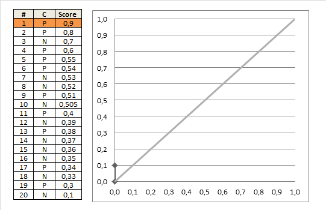

# 模型评价标准

## 一些基础的定义

- TP(True Positives)：预测为正样本，实际上也为正样本的样本数；
- FP(False Positives)：预测为正样本，实际上为负样本的样本数；
- TN(True Negatives)：预测为负样本，实际上也为负样本的样本数；
- FN(False Negatives)：预测为负样本，实际上为正样本的样本数。

## 分类模型的评价指标

### 准确率(Accuracy)

所有预测准确的样本占总体样本的比例
$$
Accuracy = \frac{TP + TN}{TP + FP + TN + FN}
$$

### 精确率(Precision)

正确预测为正的样本占所有预测为正的比例
$$
Precision = \frac{TP}{TP + FP}
$$

### 召回率(Recall)

正确预测为正的样本占所有实际为正的比例
$$
Recall = \frac{TP}{TP + FN}
$$

### F1-score

$$
F1 = \frac{2\times precision \times recall}{precision + recall}
$$

### TPR(True Positive Rate)

所有正样本中被分类为正的样本比例,等同于召回率
$$
TPR = \frac{TP}{TP + FN}
$$

### FPR(False Positive Rate)

所有负样本中被分类为正的样本比例
$$
FPR = \frac{FP}{FP + TN}
$$

### ROC and AUC

在许多分类模型中，产生的是一个概率预测值，然后将这个概率预测值与一个提前设定好的分类阈值进行比较，大于该阈值则认为是正例，小于该阈值则认为是负例。如果对所有的排序结果按照概率值进行降序排序，那么阈值可以将结果截断为两部分，前面的认为是正例，后面的认为是负例。我们可以根据实际任务的需要选取不同的阈值。如果重视精确率，我们可以设定一个很高的阈值，如果更重视召回率，可以设定一个很低的阈值。

阈值到底该设定为多少呢？有没有可以不设定阈值来直接评价我们的模型性能的方法呢？

ROC全称是“受试者工作特征”，（receiver operating characteristic）。我们根据模型的预测结果进行排序，然后按此顺序逐个把样本作为正例进行预测，每次计算出两个重要的值，分别以这两个值作为横纵坐标作图，就得到了ROC曲线。

ROC曲线的横轴为FPR；纵轴为TPR

ROC计算过程如下：

1. 首先每个样本都需要有一个label值，并且还需要一个预测的分数
2. 然后按这个score对样本由大到小进行排序，假设这些数据位于表格中的一列，从上到下依次降序;
3. 现在从上到下按照样本点的取值进行划分，位于分界点上面的我们把它归为预测为正样本，位于分界点下面的归为负样本;
4. 分别计算出此时的TPR和FPR，然后在图中绘制（FPR, TPR）点。

显然，ROC曲线的横纵坐标都在[0,1]之间，自然ROC曲线的面积不大于1。现在我们来分析几个**特殊情况**，从而更好地掌握**ROC曲线的性质**： 

- (0,0)：假阳率和真阳率都为0，即分类器全部预测成负样本 
- (0,1)：假阳率为0，真阳率为1，全部完美预测正确
- (1,0)：假阳率为1，真阳率为0，全部完美预测错误
-  (1,1)：假阳率和真阳率都为1，即分类器全部预测成正样本 
- TPR＝FPR，斜对角线，预测为正样本的结果一半是对的，一半是错的，代表随机分类器的预测效果

于是，我们可以得到基本的结论：**ROC曲线在斜对角线以下，则表示该分类器效果差于随机分类器，反之，效果好于随机分类器，当然，我们希望ROC曲线尽量处于斜对角线以上，也就是向左上角（0,1）。** 

AUC(Area Under the ROC curve)就是出于ROC曲线下方的面积(通常使用积分求得)，这个面积越大说明模型的性能越优越

## 回归模型的评价指标

### 平均绝对误差(MAE)

$$
MAE(y, \hat{y}) =\frac{1}{n}\displaystyle\sum_{i = 1}^n |y_i - \hat{y}_i|
$$

### 均方误差(MSE)

$$
MSE(y, \hat{y}) =\frac{1}{n}\displaystyle\sum_{i = 1}^n (y_i - \hat{y}_i)^2
$$

### 均方根误差(RMSE)

$$
RMSE(y, \hat{y}) =\sqrt{\frac{1}{n}\displaystyle\sum_{i = 1}^n (y_i - \hat{y}_i)^2}
$$

### 均方对数误差(MSLE)

$$
MSLE(y, \hat{y}) =\frac{1}{n}\displaystyle\sum_{i = 1}^n\big(log(1 + y_i) - log(1 + \hat{y}_i)\big)^2
$$
